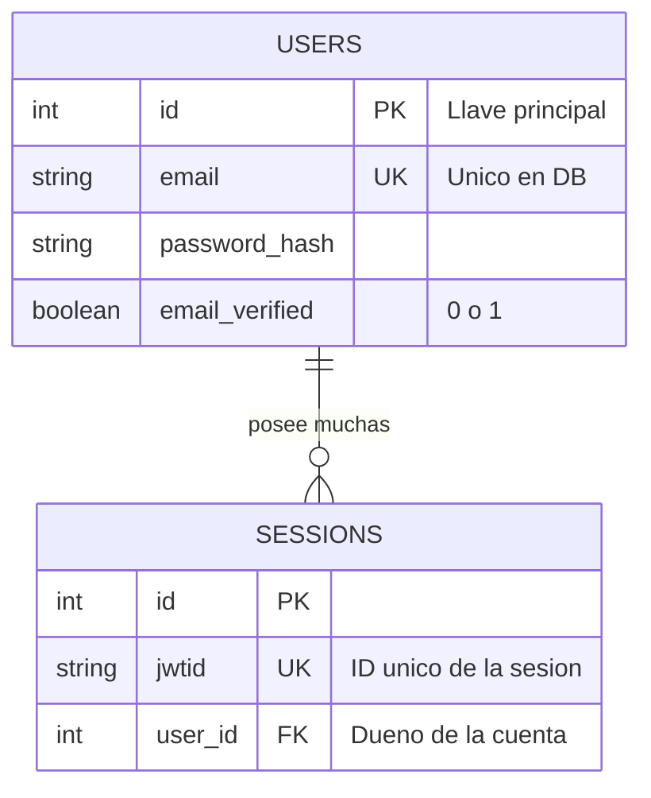
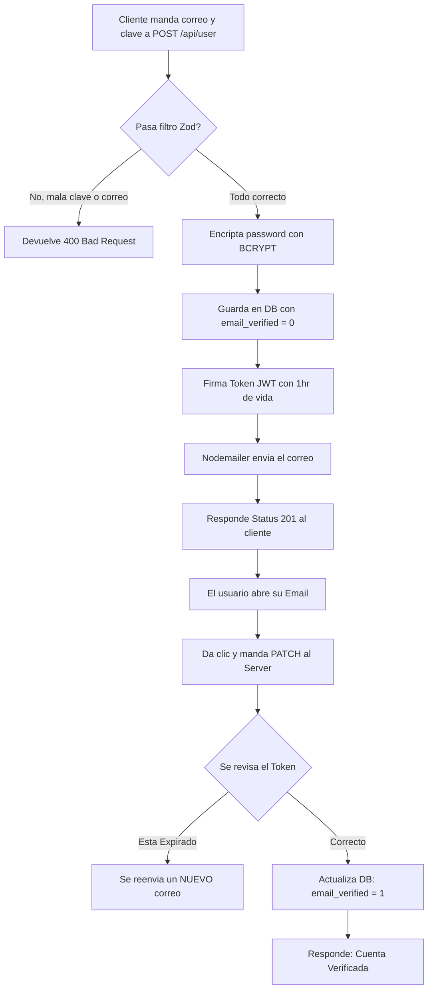
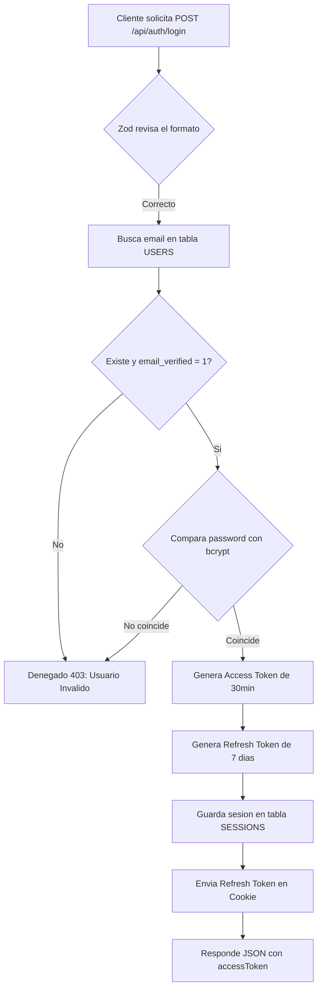
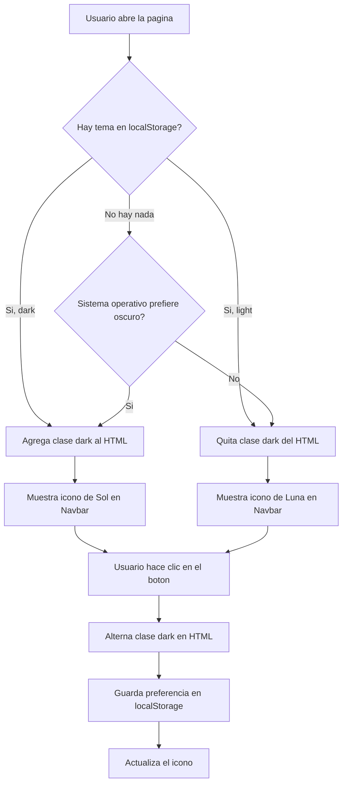

# 5. Diagramas y Estructura Organizativa

> **Tip:** Para ver estos diagramas de forma gráfica en VSCode, abre este archivo y presiona `Ctrl + Shift + V` (con la extensión **Markdown Preview Enhanced** instalada).

A veces es mucho más fácil estudiar un código si lo vemos visualmente en vez de leer líneas completas. A continuación tienes el panorama visual de qué es lo que hace tu aplicación basándonos en la estructura de tu profesor.

## 1. Organización de Carpetas (La Arquitectura)

Tu proyecto se rige por un esquema de "módulos de características" (features). Todo está concentrado dentro de carpetas independientes para no mezclar lógicas. Así está la radiografía:

```text
sistema-facturacion/
├── apps/
│   ├── api/                              (Tu Servidor / Backend)
│   │   ├── db/
│   │   │   ├── index.js                  # Conexión a la base de datos
│   │   │   └── tables.js                 # CREATE TABLE en SQLite
│   │   ├── features/
│   │   │   ├── auth/                     # Login, verificación, sesiones
│   │   │   └── user/                     # Registro de usuarios nuevos
│   │   ├── services/
│   │   │   └── nodemailer.js             # Envío de correos con Gmail
│   │   ├── .env                          # Claves secretas (NO subir a GitHub)
│   │   ├── config.js                     # Variables de configuración
│   │   ├── index.js                      # App principal en puerto 3000
│   │   ├── package.json                  # Dependencias del backend
│   │   └── test.http                     # Pruebas manuales de las rutas
│   └── client/                           (Tu Frontend / Interfaz Visual)
│       └── src/
│           ├── components/               # Navbar, Spinner, Notificaciones
│           ├── features/                 # Lógica de autenticación del cliente
│           ├── layout/                   # Layouts base (público, privado)
│           ├── pages/                    # index, login, signup, verify
│           └── styles/
│               └── global.css            # Tailwind + configuración dark mode
└── documentacion/                        # Carpeta de estudio y repaso
```

---

## 2. Diagrama de la Base de Datos (Relaciones)

Actualmente nuestra base de datos trabaja con estas entidades que se complementan por sus llaves foráneas (FK):



*(Cuando agreguemos productos y ventas, aparecerán más tablas conectadas aquí)*

---

## 3. Diagrama de Flujo: Creacion de Cuenta y Verificacion

Así es como tu computadora toma sus decisiones en `features/user/user.routes.js`:



---

## 4. Diagrama de Flujo: Iniciando Sesion (Login)

Cuando mandas la validacion a `features/auth/auth.routes.js`, el backend hace el chequeo:



---

## 5. Diagrama de Flujo: Sistema de Temas (Dark Mode)

Asi funciona el toggle de modo oscuro/claro en el frontend:


