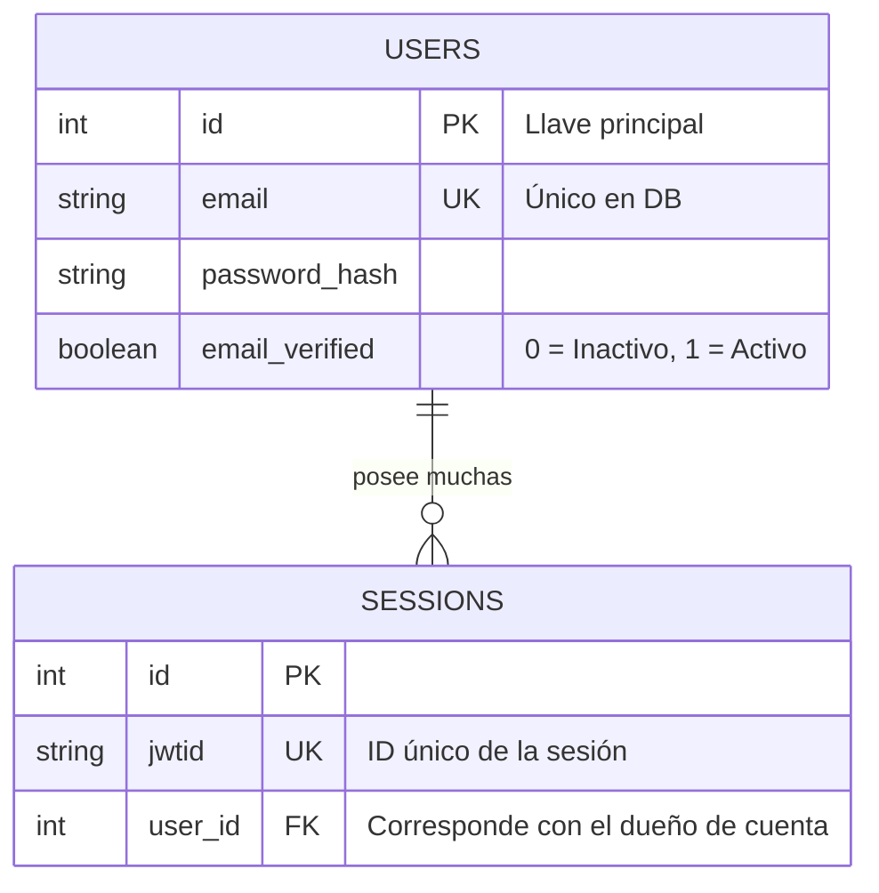
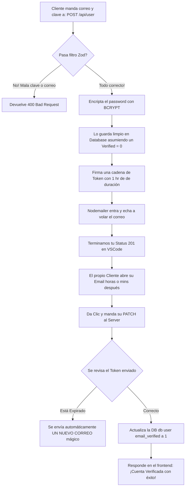
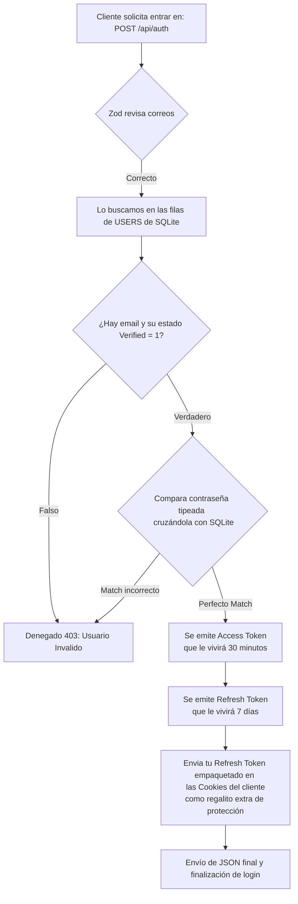

# 5. Diagramas y Estructura Organizativa

A veces es mucho más fácil estudiar un código si lo vemos visualmente en vez de leer líneas completas. A continuación tienes el panorama visual de qué es lo que hace tu aplicación basándonos en la estructura de tu profesor.

## 1. Organización de Carpetas (La Arquitectura)
Tu proyecto se rige por un esquema de "módulos de características" (features). Todo está concentrado dentro de carpetas independientes para no mezclar lógicas. Así está la radiografía:

```text
sistema-facturacion/
├── apps/
│   ├── api/  (Tu Servidor / Backend actual)
│   │   ├── db/
│   │   │   ├── index.js              # Conexión para tu base "contacts.db"
│   │   │   └── tables.js             # Aquí definiste SQLite (CREATE TABLE)
│   │   ├── features/
│   │   │   ├── auth/                 # Todo para Iniciar Sesión (Rutas, Middlewares, SQL)
│   │   │   └── user/                 # Todo para el Registro de nuevos sujetos
│   │   ├── services/
│   │   │   └── nodemailer.js         # Archivo del correo, se conecta con Gmail
│   │   ├── .env                      # 🤫 Claves secretas de tokens y correo
│   │   ├── index.js                  # El motor. Es la app principal corriendo en puerto 3000
│   │   ├── package.json              # El listado de dependencias (express, bcrypt, zod...)
│   │   └── test.http                 # Tu archivo vital para hacer pruebas manuales
│   └── client/                       # (La interfaz de usuario visual va a desarrollarse aquí)
└── documentacion/                    # ¡Carpeta para tu lectura y repaso de estudio!
```

---

## 2. Diagrama de la Base de Datos (Relaciones)
Actualmente nuestra base de datos (ER Diagram) trabaja con estas entidades del profesor que se complementan por sus llaves foráneas (`FK`):


*(Tengamos en cuenta que cuando agreguemos productos y ventas, la tabla USERS heredará mucha más responsabilidad).*

---

## 3. Diagrama de Flujo: Creación de Cuenta y Verificación
Si te confunden las validaciones al registrarte, así es como tu computadora toma sus decisiones en `features/user/user.routes.js`:



---

## 4. Diagrama de Flujo: Iniciando Sesión (Login)
Cuando mandas la validación a `features/auth/auth.routes.js`, el backend de tu profesor hace el chequeo cruzado de esta manera:


