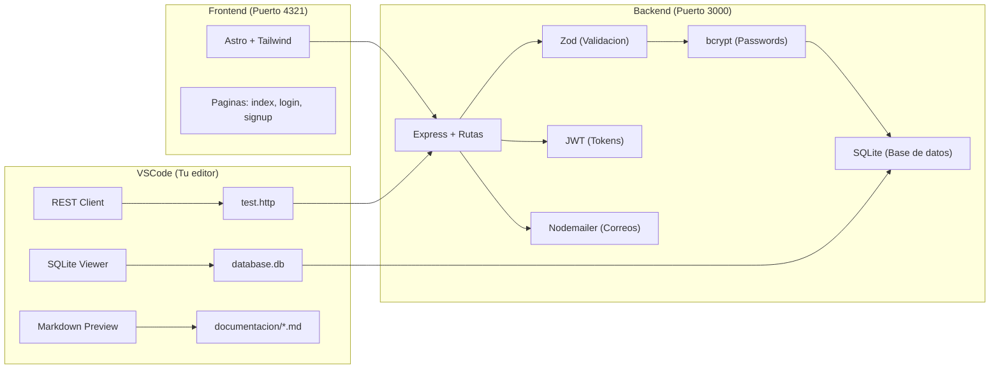

# 6. Librerias (NPM) y Extensiones de VSCode

> **Tip:** Presiona `Ctrl + Shift + V` para ver este documento con formato bonito.

## 1. Librerias Instaladas en tu Backend (Dependencias)

Estas se instalan en la carpeta `node_modules` cuando ejecutas `npm install`.

| Libreria | Para que sirve |
|---|---|
| **express** | Crea el servidor web y maneja las rutas HTTP (GET, POST, PATCH, etc.) |
| **better-sqlite3** | Conecta con la base de datos SQLite. Guarda todo en un archivo `.db` |
| **bcrypt** | Encripta las contraseñas. Convierte "Password123" en un hash imposible de revertir |
| **jsonwebtoken** | Crea y verifica los tokens JWT (pasaportes digitales de sesion) |
| **zod** | Valida los datos de entrada (que el correo sea correo, que la clave tenga 8 chars) |
| **nodemailer** | Envia correos electronicos automaticos usando tu cuenta de Gmail |
| **cors** | Permite que el Frontend (puerto 4321) se comunique con el Backend (puerto 3000) |
| **cookie-parser** | Lee las cookies del navegador donde guardamos el Refresh Token |

---

## 2. Extensiones de VSCode (Instaladas)

Estas son las extensiones que necesitas tener instaladas en Visual Studio Code para trabajar correctamente con el proyecto:

### Extensiones Esenciales

| Extensión | ID en VSCode | Para qué sirve | Cómo se usa |
|---|---|---|---|
| **REST Client** o **HttpYac** | `humao.rest-client` | Probar tus rutas del backend sin salir de VSCode | Abre `test.http`, verás botones "Send Request" encima de cada petición. Haz clic para enviar |
| **Astro** | `astro-build.astro-vscode` | Resaltado de sintaxis y autocompletado para archivos `.astro` | Se activa automáticamente al abrir archivos `.astro` |

### Extensiones Recomendadas

| Extensión | ID en VSCode | Para qué sirve | Cómo se usa |
|---|---|---|---|
| **Markdown Preview Enhanced** | `shd101wyy.markdown-preview-enhanced` | Ver los archivos `.md` con formato bonito y diagramas Mermaid renderizados | Abre un `.md` y presiona `Ctrl + Shift + V` para ver la vista previa |
| **SQLite Viewer** | `qwtel.sqlite-viewer` | Ver el contenido de tu base de datos como si fuera Excel | Haz doble clic en el archivo `database.db` y se abre como tabla |
| **Tailwind CSS IntelliSense** | `bradlc.vscode-tailwindcss` | Autocompletado y preview de colores para clases de Tailwind | Se activa automáticamente al escribir clases CSS en los archivos |

### Cómo instalar una extensión

1. Presiona `Ctrl + Shift + X` para abrir el panel de extensiones
2. Escribe el nombre de la extensión en el buscador
3. Haz clic en **Install**

---

## 3. Diagrama: Como se conectan las herramientas

